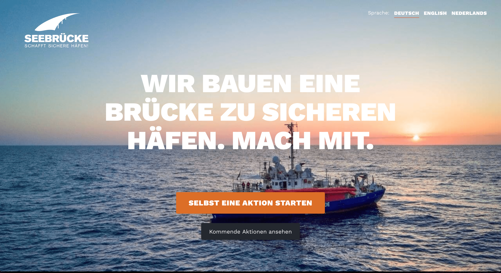

# Seebrücke Wordpress Theme



## Development

### Wordpress plugin requirements

- [meta-box](https://wordpress.org/plugins/meta-box/)
- [polylang](https://wordpress.org/plugins/polylang/)

### Install dependencies

`npm install`


### Build production assets

`npm run build`


### Build development assets

`npm run dev`


## Structure

The page consists of 5 content types:

- Organizations
- Events
- Pages
- Header
- Footer

### Organizations

Organizations are used to create the supporting organizations area. Currently they consist of:

- `Name`: Name of the organization
- `Url`

### Events

- `Featured Image`: if set, the page header is replaced by an image
- `Title`
- `Text`
- `City`
- `Address`: this field is used to determine the coordinates of event
- `Date`
- `Time`
- `Type`
- `Link`: optional (external) Link

### Pages

- `Featured Image`: if set, the page header is replaced by an image

### Header

Headers are used to render the hero image on the front page. Currently they consist of:

- `Title`: big text, which is rendered below the logo
- `Text`: some additional text (e.g. notes ...), which would be rendered under the action button
- `Action text`: label for the big action button (if not set, the button doesn't get rendered)
- `Link`: Target, where the action button links to (if not set, the button doesn't get rendered)
- `Secondary action text`: Label for the secondary action button, under the primary one (if not set, the button doesn't get rendered)
- `Secondary link target`: Target, where the action button links to; this can ba anything, e.g. anchors, internal oder external links (if not set, the button doesn't get rendered)
- `Support text`: label for the "follow us" box under the header
- `Facebook-Link`
- `Instagram-Link`
- `Twitter-Link`

### Footer

- `Text`
- `Mailchimp URL`: URL where the newsletter subscribe is submitted to
- `Mailchimp enabled`: flag which toggles the newsletter subscribe form


## Shortcodes

The whole frontpage is composed through shortcodes. If you want to use any of the widgets there, or even more, please have a look into the "Startpage" of each language.


### Featured

`[featured id="" [title=""] [subtitle=""]]`

The featured shortcode can be used to create a teaser to a certain page. It expects `id` (the wordpress page id) and will the use the featured image of the page as background-image and the title of the page as text, which is linked to the page itself.

It is possible to overwrite `title` by setting the `title` attribute. `subtitle` is used to generate a text, which is prefixed to the title and a bit smaller.


### Paypal

Renders a donate with paypal widget.

`[paypal]`


### Supporting organizations

Renders a list of supporting organizations.

`[supporting_organizations]`


### Become supporter

Renders the "Become a supporter" columns. `[become_supporter]` always consists of `[become_supporter_item]`s.

```
[become_supporter]
[become_supporter_item icon="flag|bulhorn|users" title=""]content[/become_supporter_item]
[become_supporter_item title=""]content[/become_supporter_item]
[/become_supporter]
```


### Donate

`[donate href="" label=""]`

Renders a donate button. `href` is the target, `label` refers to the button label.


### Actions

`[actions]`

Shows all actions.

`[actions upcoming]`

Shows all upcoming events.

`[actions upcoming="2"]`

Shows upcoming events for the next two days. It is possible to filter the upcoming events by tags. In order to do so, please use the `tags="tag-slug1,tag-slug2"` (OR) or `tags="tag-slug1+tag-slug2"` (AND) attribute.

#### Additional attributes

- `href`
- `label`

If both are set, an "All actions" link will be visible under the actions.
